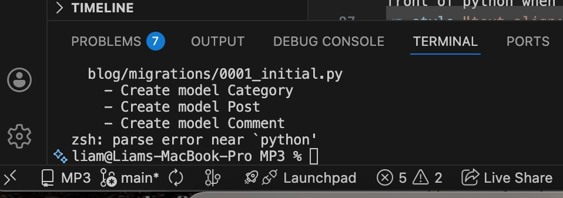
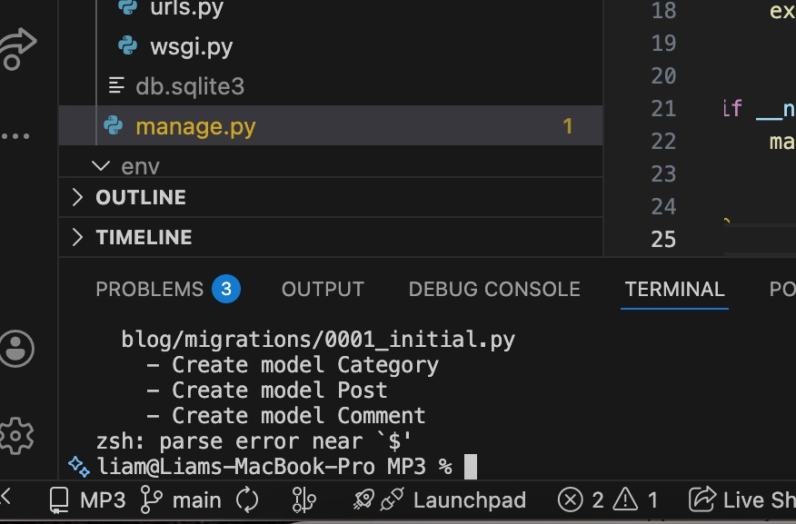

# MP3
## Blog 

# Python Project

## Design of Logo and Favicon
The design and logo are reflective of a handwritten letter but with a modern twist of it being a blog post. 
The seal on the letter is red and for the final design it was decided that red would be an appropriate background colour.

The favicon had to be simple and easy as it will be small anyway to the user. So a simple shape of the envelope in a red background was enough.

the final  favicon design...

# Wireframes and mockups
The wireframes are very basic and include an image and text box which is scrollable and a main page homepage window.

For Mobile...

 
For Tablets...

For Desktop...

## Tools used
<ul>
<li>VS Code</li>
<li>Canva</li>
<li>Figma</li>
<li>Django</li>
</ul>

# References/Citations
https://code.visualstudio.com/docs/python/environments
https://code.visualstudio.com/docs/sourcecontrol/overview

https://syncromsp.com/blog/how-to-check-python-version/

https://www.markdownguide.org/

https://www.markdownguide.org/hacks/#overview

### Python code
https://docs.python.org/3/

### Virtual Environments..
https://realpython.com/python-virtual-environments-a-primer/#:~:text=You%20activate%20a%20venv%20on,and%20choosing%20Python%3A%20Select%20Interpreter.

https://www.w3schools.com/python/python_virtualenv.asp

https://realpython.com/build-a-blog-from-scratch-django/

http://localhost:8000/

https://www.geeksforgeeks.org/python/djnago-installation-and-setup/

https://www.reddit.com/r/learnpython/comments/18lfequ/not_sure_why_i_keep_getting_this_error_zsh/

### Migrations
https://docs.djangoproject.com/en/5.2/topics/migrations/

### Directory/files

https://docs.python.org/3/search.html?q=no+such+file+or+directory

### Errors
'Parse error'
https://proxys.io/en/blog/life-hacking/parse-error-in-python-why-does-this-error-occur-and-how-to-avoid-it#:~:text=A%20parse%20error%20occurs%20when,structure%20will%20cause%20a%20ParseError.
 

## Bugs and Issues
Trying to activate a virtual environent (VE) seemed problematic and caused issues of <em>"parse error" </em> along with <em>"zsh command not found"</em> and <em>"no such file or directory exists."</em>

With the revelation that Mac users (myself being one of them) have to add a "3" in front of python when activating the VE. This helped to install pip and Django.

<em>
"python3 activate...."</em>

However, the <em>"command not found"</em> and <em>"no such directory exists" </em>issues persisted. 

