# MP3
## Blog 
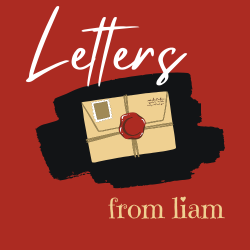
Python Project

## Design of Logo and Favicon
The design and logo are reflective of a handwritten letter but with a modern twist of it being a blog post. 
The seal on the letter is red and for the final design it was decided that red would be an appropriate background colour.
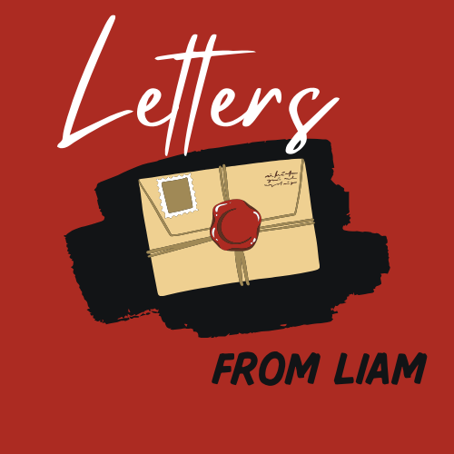
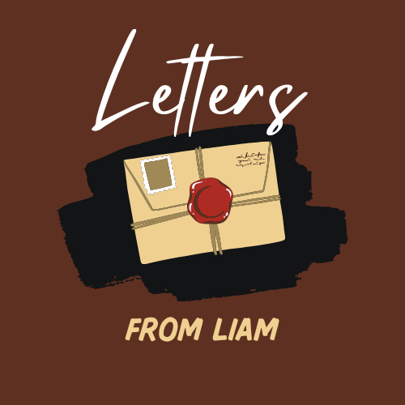
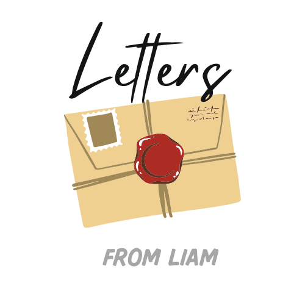
The favicon had to be simple and easy as it will be small anyway to the user. So a simple shape of the envelope in a red background was enough.
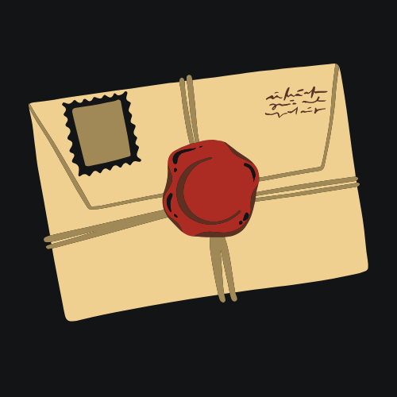
the final  favicon design...
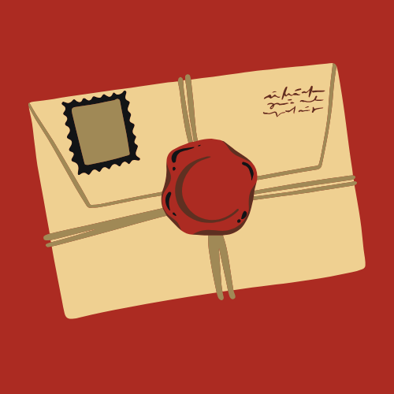

# Wireframes and mockups
The wireframes are very basic and include an image and text box which is scrollable and a main page homepage window.

For Mobile...
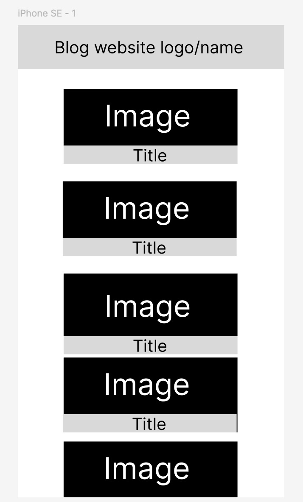
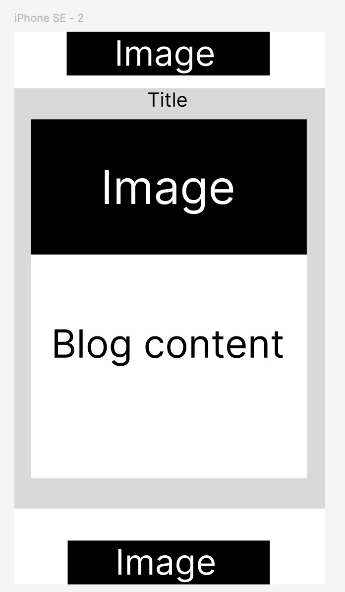
 
For Tablets...
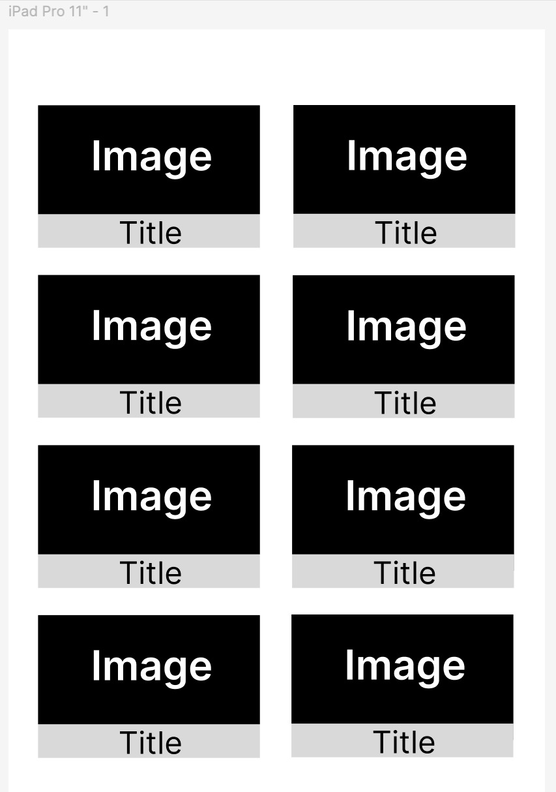
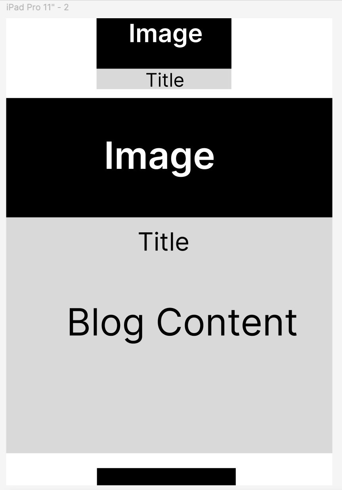
For Desktop...
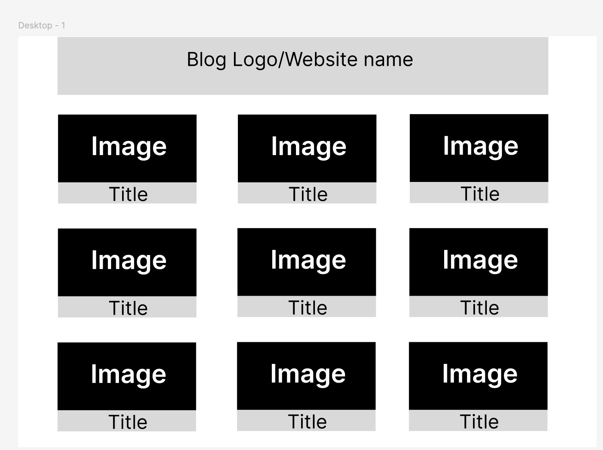
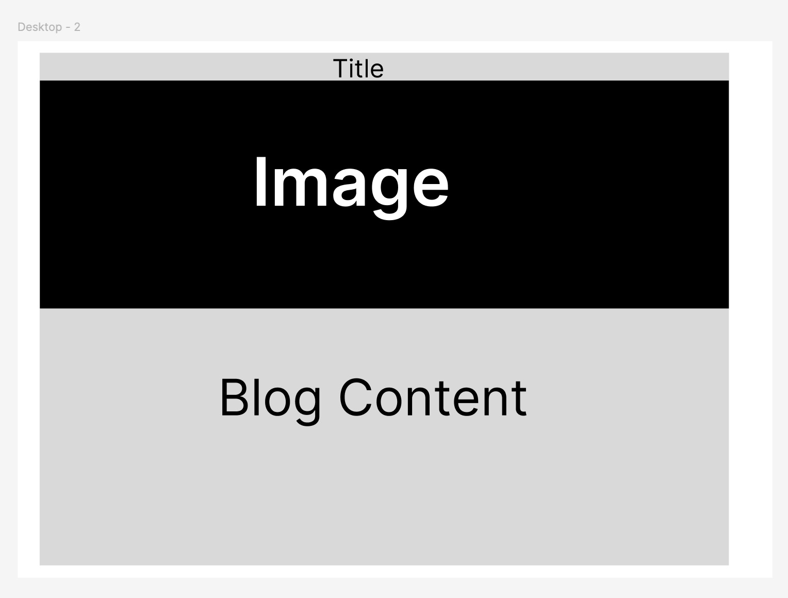

## Tools used
<ul>
<li>VS Code</li>
<li>Canva</li>
<li>Figma</li>

</ul>

## References/Citations
https://code.visualstudio.com/docs/python/environments
https://code.visualstudio.com/docs/sourcecontrol/overview

https://syncromsp.com/blog/how-to-check-python-version/

### Virtual Environments..
https://realpython.com/python-virtual-environments-a-primer/#:~:text=You%20activate%20a%20venv%20on,and%20choosing%20Python%3A%20Select%20Interpreter.

https://www.w3schools.com/python/python_virtualenv.asp

https://realpython.com/build-a-blog-from-scratch-django/

http://localhost:8000/

https://www.geeksforgeeks.org/python/djnago-installation-and-setup/

### Migrations
https://docs.djangoproject.com/en/5.2/topics/migrations/

### Directory/files

https://docs.python.org/3/search.html?q=no+such+file+or+directory

